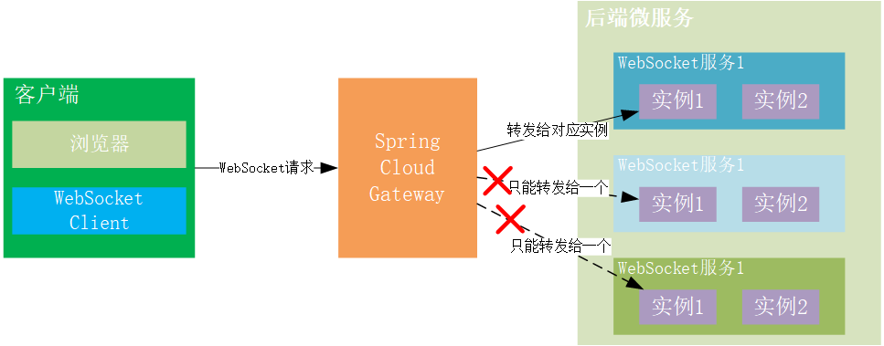
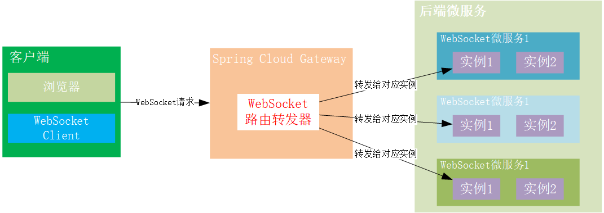
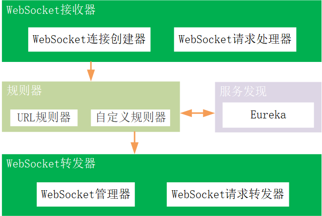

>Gateway的多WebSocket请求转发实现

## 1 功能点

- 前端Client与后台多WebSocket微服务1多N支持

- WebSocket通道全生命周期管理

## 2 Zuul的缺陷

完全不支持转发WebSocket请求。

## 3 Spring Cloud Gateway的局限

一个WebSocket客户端只能将请求转发给一个特定的后台服务，无法完成一个WebSocket客户端通过网关API对接后台多个WebSocket微服务。



## 4 Linkis的解决方案

Linkis在Spring Cloud Gateway中，实现了WebSocket路由转发器，用于与客户端建立WebSocket连接，建立连接成功后，会自动分析客户端的WebSocket请求，通过规则判断出请求该转发给哪个后端微服务，从而将WebSocket请求转发给对应的后端微服务实例。



WebSocket路由转发器，向上对接客户端的WebSocket请求，向下对接后端的多个WebSocket微服务实例，为了实现基于规则转发客户端的WebSocket请求给对应的后端微服务实例，WebSocket路由转发器的架构图如下：



###	4.1 WebSocket接收器

1)	WebSocket接收器是Spring Cloud Gateway的一个全局过滤器，用于接收客户端的WebSocket连接请求，创建客户端与Spring Cloud Gateway的1对1WebSocket通信通道。

2)	同时，会监听该WebSocket通道，将客户端发送过来的请求，获取必要的基本信息（如请求address、uri和user等），进行简单的封装，传递给规则器进行处理。

### 4.2 规则器

1)	规则器接收到WebSocket接收器的通知，开始使用规则进行处理

2)	URL规则器。

Linkis规定客户端请求的文本帧（TextWebSocketFrame）的格式为JSON格式的字符串，例如下：

```json
"{'method': '/api/v1/${service}/${uriPath}', 'data': ''}"
```

 其中:

 method为实际的请求URI，前面/api固定为API请求，v1指API的版本，service为请求的服务名称，uriPath为服务的实际请求URI；

 data为实际的请求数据。

 通过解析method，获取到service信息，传给第4步。

3)	如果客户端请求的文本帧（TextWebSocketFrame）不符合URL规则器的标准格式，或URL规则器不能解析出service信息，这时会加载用户自定义规则器进行解析service，如果所有的自定义规则器都不能解析出service信息，则直接抛出一个解析错误给到客户端；否则直接将service信息传递给下一步

4)	通过步骤2或步骤3，获取到service信息，此时规则器会从服务发现服务（如Eureka）中，拿到所有健康状态为正常的微服务列表，找到所有的该微服务service实例，通过负载均衡的方式，选择其中一个负载最小的实例，将该微服务service实例传递给WebSocket转发器。

###	4.3 WebSocket转发器

WebSocket转发器分为WebSocket管理器和WebSocket请求转发器。

1)	WebSocket管理器

WebSocket管理器负责管理客户端与WebSocket接收器的1对1WebSocket连接通道，和WebSocket转发器与后端微服务实例的1对多WebSocket连接通道。

如果客户端与WebSocket接收器的WebSocket连接断开，则WebSocket管理器会马上断开所有相关的WebSocket转发器与后端微服务实例的1对多WebSocket连接通道；

同时，为了保持所有WebSocket转发器与后端微服务实例的1对多WebSocket连接通道不会因为空闲而被释放， WebSocket管理器会定时发送心跳请求（PingWebSocketFrame）给对应的后端微服务实例。

2)	WebSocket请求转发器

WebSocket请求转发器从规则器获取微服务service实例信息

这里需注意service和service实例的区别：一个微服务会有多个实例，每个实例的功能完全相同，一个微服务之所以需要多个实例，是为了保证微服务的高可用和高可靠

先从WebSocket管理器中为该客户端和该微服务service寻找是否已经存在WebSocket转发器到该微服务service的WebSocket连接通道，如果存在，则直接使用该webSocket连接通道转发客户端请求的文本帧（TextWebSocketFrame）；否则为该客户端和该微服务service实例创建一个全新的webSocket连接，并将该新的WebSocket连接和客户端与WebSocket接收器的1对1WebSocket连接通道进行绑定，保证后端微服务一旦通过该新的WebSocket连接实时推送信息，立马将该信息通过客户端与WebSocket接收器建立的连接通道，回推给客户端。
